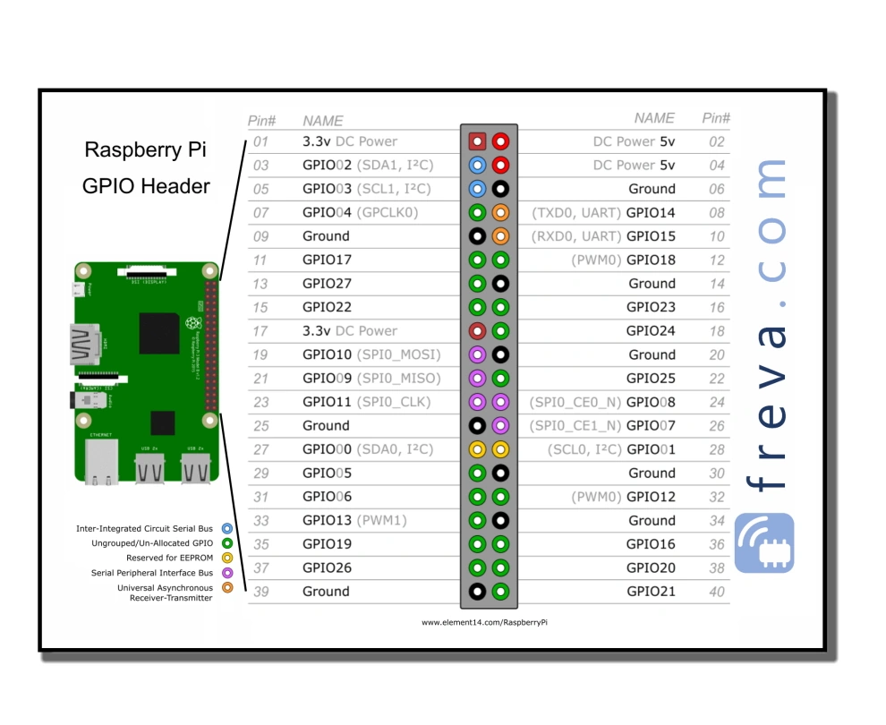

https://www.freva.com/fr/commencer-a-programmer-le-gpio-du-raspberry-pi/

# ultrasonic_distance:

– connect the VCC pin of the sensor with a 5V pin (red wire)
– connect the Trig pin of the sensor to pin 23 (green wire)
– connect the Echo pin of the sensor to the 1kOhm resistor, connect the other end of the resistor to pin 24 (yellow wire)
– connect the GND of the sensor to the “-” row of the breadboard and also connect the GPIO GND to the “-” row of the breadboard (black cable)
– insert the 2kOhm resistor between pin 24 and the “-” row

The 2 resistors are used to reduce the voltage of the Echo signal from 5V to 3.3V.  
Connecting the Echo pin directly to a GPIO pin (provided for 3.3V) could damage it.  
We do this on the basis of the “Voltage divider” principle.

# LCD_display

https://en.wikipedia.org/wiki/Liquid-crystal_display

https://github.com/dhylands/python_lcd/tree/master/lcd

# 8x8 display

...

